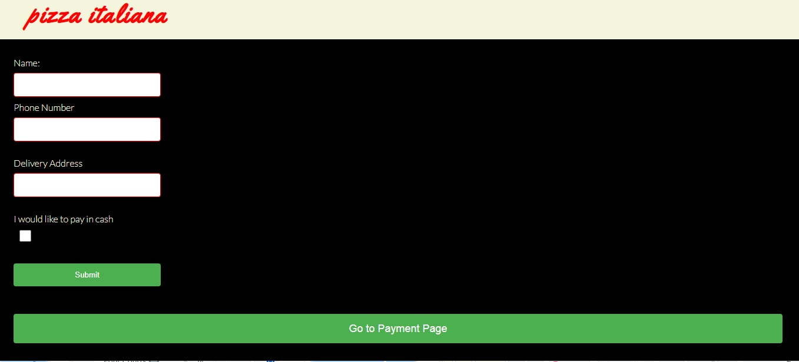
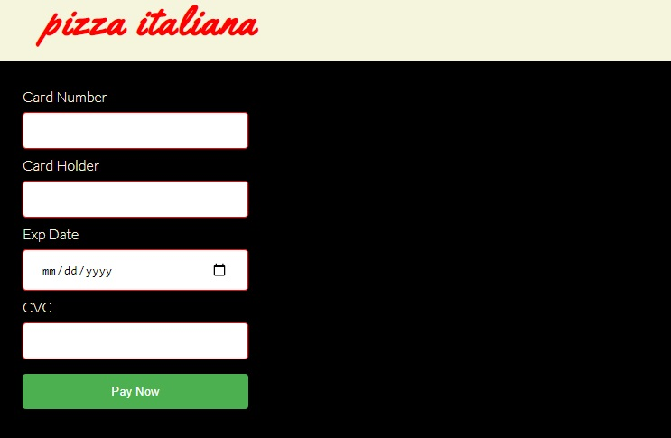

# Pizza italiana website
[view the live link here](https://ourfalia.github.io/my-first-repository/)
 
Pizza Italiana is a marketing website for pizza italiana restaurant. It allows people to view the products of the restaurant and order online. The websit offers a varity of options for pizza lovers as well as dessert and drinks menu.
 

## Features
The website consist of a main page which includes a header, main sections and footer.
The header includes a clickable logo and navigation bar which marks the menue and adress on the same page. The main sections include three menus where people can check the items they want to order. 
a large buttom is provided to submit the order which takes you to the personal details page.
 

 
The personal details page has a form with fiels for the name, phone number and address.
There is also and option for cash payment otherwise you can click on the go to payment page in order to pay online.
 

 
The last page is the payment page, where there is another form to fill in the payment information.
 

 
The footer section contains contact information including location on Google maps.
 

 

## Technologies used
1. HTML
2. CSS
3. GIThub 
4. Fontawesome
5. Google fonts

## Testing 
The W3C Markup validator and W3C CSS validator services were used to validate the pages of the project to ensure that there were no errors in the code. 

[W3C Markup validator results](https://validator.w3.org/nu/?doc=https%3A%2F%2Fourfalia.github.io%2Fmy-first-repository%2F)
[W3C CSS validator results](https://jigsaw.w3.org/css-validator/validator?uri=https%3A%2F%2Fvalidator.w3.org%2Fnu%2F%3Fdoc%3Dhttps%253A%252F%252Fcode-institute-org.github.io%252Flove-running-2.0%252Findex.html&profile=css3svg&usermedium=all&warning=1&vextwarning=&lang=en#css)

Manual testing of all the features of the website was deploied and everything looks fuctioning such as the navigation bar, links and forms.
## Unfixed bugs 
When the website was tested on the W3C validator, it marked this error "Bad value 100% for attribute width on element iframe". I kept the 100% value for the map to cover the whole parent div and look better in contrast with the rest of the page. 

## Deployment 
The site was deployed to GitHub pages. The steps to deploy are as follows:
In the GitHub repository, navigate to the Settings tab
From the source section drop-down menu, select the Master Branch
Once the master branch has been selected, the page will be automatically refreshed with a detailed ribbon display to indicate the successful deployment.
The live link can be found here: https://ourfalia.github.io/my-first-repository/

## Credits
The keyframes code used in the header section was taken from the love running project at https://codeinstitute.net/.
The icons in the footer were taken from Font [Awesome](https://fontawesome.com/)
Images were downloaded from free source: https://pixabay.com/

## Acknowledgement
I would like to thank my mentor for his support and Code Institute team  

