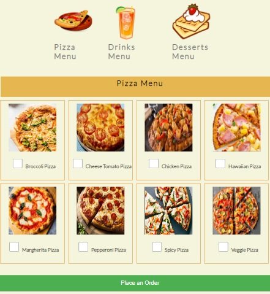

# Pizza italiana website
[view the live link here](https://ourfalia.github.io/my-first-repository/)
 
Pizza Italiana is a marketing website for pizza italiana restaurant. It allows people to view the products of the restaurant and order online. The websit offers a varity of options for pizza lovers as well as dessert and drinks menu.
 

## Features
The website consist of a main page which includes a header, main sections and footer.
The header includes a clickable logo and navigation bar which marks the menue and adress on the same page. The main sections include three menus where people can check the items they want to order. 
a large buttom is provided to submit the order which takes you to the personal details page.
 

 
The personal details page has a form with fiels for the name, phone number and address.
There is also and option for cash payment otherwise you can click on the go to payment page in order to pay online.
 

 
The last page is the payment page, where there is another form to fill in the payment information.
 

 
The footer section contains contact information including location on Google maps.
 

 
## Testing 

